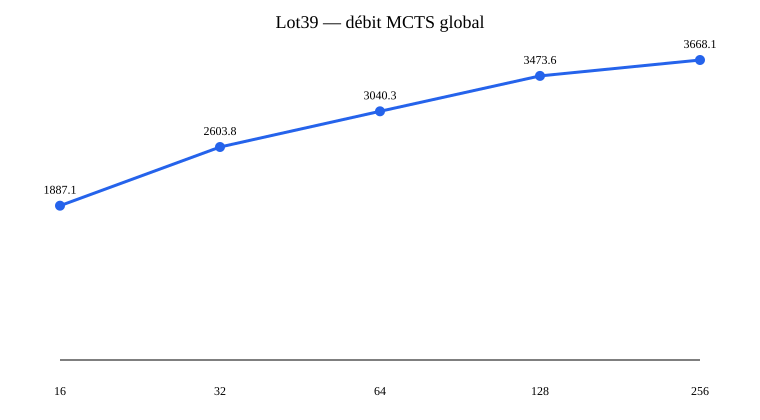
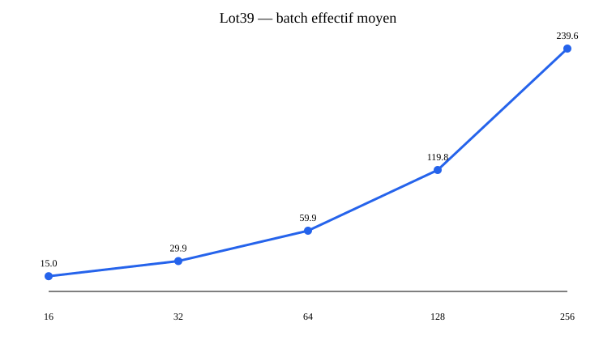

# Lot 39 — GPU Parallel MCTS Scaling

Ce rapport est généré exclusivement depuis les artefacts JSON du Lot 39. Il mesure l'infrastructure, pas la force de G4.

| Recherches | Simulations/s | Speedup N=16 | Speedup CPU Lot38 | Batch moyen | Batch p95 |
|---:|---:|---:|---:|---:|---:|
| 16 | 1887.06 | 1.000 | 1.142 | 14.97 | 16.00 |
| 32 | 2603.82 | 1.380 | 1.576 | 29.95 | 32.00 |
| 64 | 3040.35 | 1.611 | 1.840 | 59.90 | 63.00 |
| 128 | 3473.56 | 1.841 | 2.102 | 119.79 | 124.00 |
| 256 | 3668.09 | 1.944 | 2.220 | 239.58 | 246.00 |





## Décision

```json
{
  "GPU_PARALLEL_SCALING_VALID": "YES",
  "BEST_TESTED_CONCURRENCY": 256,
  "BEST_GLOBAL_SIMULATIONS_PER_SECOND": 3668.0900137098834,
  "BEST_SPEEDUP_VS_CPU_REFERENCE": 2.2199046017746107,
  "GPU_SATURATION_POINT": "ABOVE_256",
  "GPU_STARVED_BY_CPU": "YES",
  "PRIMARY_RUNTIME_BOTTLENECK": "CPU_COORDINATION",
  "SECONDARY_RUNTIME_BOTTLENECK": "TREE_MANAGEMENT",
  "DEEP_MCTS_GPU_INFRASTRUCTURE_READY": "YES",
  "NEXT_CONCURRENCY_TEST": null,
  "NEXT_ACTION": "MCTS_CPU_PIPELINE_OPTIMIZATION",
  "TRAINING_PERFORMED": "NO",
  "OPTIMIZER_CREATED": "NO",
  "BACKWARD_CALLED": "NO",
  "MODEL_WEIGHTS_CHANGED": "NO"
}
```

Aucun entraînement, optimiseur, backward ou changement des poids n'a été effectué.
